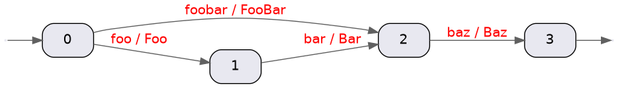

# lucene-grep
Grep-like utility based on [Lucene Monitor](https://lucene.apache.org/core/8_2_0/monitor/index.html) compiled with GraalVM native-image.

## Features

- Supports Lucene query syntax as described [here](https://lucene.apache.org/core/2_9_4/queryparsersyntax.html)
- Multiple queries can be provided
- Queries can be loaded from a file
- Supports Lucene text analysis configuration for:
  - char filters
  - tokenizers
  - token filters
  - stemmers for multiple languages
  - predefined analyzers
- Support multiple query parsers (classic, complex phrase, standard, simple, and surround)
- Text output is colored or separated with customizable tags
- Supports printing file names as hyperlinks for click to open (check support for your terminal [here](https://gist.github.com/egmontkob/eb114294efbcd5adb1944c9f3cb5feda))
- Text output supports templates
- Scoring mode (disables highlighting for now)
- Output can be formatted as JSON of EDN
- Supports text input from [STDIN](https://en.wikipedia.org/wiki/Standard_streams#Standard_input_(stdin))
- Supports filtering files with [GLOB](https://en.wikipedia.org/wiki/Glob_(programming)) [file pattern](https://docs.oracle.com/javase/8/docs/api/java/nio/file/FileSystem.html#getPathMatcher-java.lang.String-)
- Support excluding files from processing with GLOB
- Compiled with [GraalVM native-image](https://www.graalvm.org/reference-manual/native-image/) tool
- Supports Linux, MacOS, and Windows
- Fast startup which makes it usable as CLI utility

Startup and memory as measured with `time` utility on my Linux laptop:


The default output has a format: `[FILE_PATH]:[LINE_NUMBER]:[LINE_WITH_A_COLORED_HIGHLIGHT]`

NOTE: Not compatible with `grep`. When compared with `grep` the functionality is limited in most aspects.

## Quickstart

### Brew

MacOS and Linux binaries are provided via `brew`.

Install:

```
brew install dainiusjocas/brew/lmgrep
```

Upgrade:

```
brew upgrade lmgrep
```

### Windows

On Windows you can install using [scoop](https://scoop.sh/) and the [scoop-clojure](https://github.com/littleli/scoop-clojure) bucket.

Or just follow these concrete steps:
```shell
# Note: if you get an error you might need to change the execution policy (i.e. enable Powershell) with
# Set-ExecutionPolicy RemoteSigned -scope CurrentUser
Invoke-Expression (New-Object System.Net.WebClient).DownloadString('https://get.scoop.sh')

scoop bucket add scoop-clojure https://github.com/littleli/scoop-clojure
scoop bucket add extras
scoop install lmgrep
```

### Other platforms

Just grab a binary from [Github releases](https://github.com/dainiusjocas/lucene-grep/releases), extract, and place it anywhere on the `$PATH`.

In case you're running MacOS then give run permissions for the executable binary:
```shell
sudo xattr -r -d com.apple.quarantine lmgrep
```

Then run it:
```shell
echo "Lucene is awesome" | ./lmgrep "Lucene"
```

## Examples 

Example of the `lmgrep`:
```shell
./lmgrep "main" "*.{clj,edn}"
=>
./src/core.clj:44:(defn -main [& args]
./deps.edn:22:   :main-opts   ["-m" "cognitect.test-runner"]}
./deps.edn:24:  {:main-opts  ["-m" "clj-kondo.main --lint src test"]
./deps.edn:28:  {:main-opts  ["-m clj.native-image core"
```

The default output is somewhat similar to `grep`, example:
```shell
grep -n -R --include=\*.{edn,clj} "main" ./
=>
./deps.edn:22:   :main-opts   ["-m" "cognitect.test-runner"]}
./deps.edn:24:  {:main-opts  ["-m" "clj-kondo.main --lint src test"]
./deps.edn:26:   :jvm-opts   ["-Dclojure.main.report=stderr"]}
./deps.edn:28:  {:main-opts  ["-m clj.native-image core"
```

Supports input from STDIN:
```shell
cat README.md | ./lmgrep "monitor lucene"
```
TIP: write your Lucene query within double quotes.

Various options with GLOB file pattern example:
```shell
./lmgrep --case-sensitive\?=false --ascii-fold\?=true --stem\?=true --tokenizer=whitespace "lucene" "**/*.md"
```
TIP: write GLOB file patterns within double quotes.

We can exclude files also with a GLOB pattern.
```shell
./lmgrep "lucene" "**/*.md" --excludes="README.md"
```
TIP: a GLOB pattern is treated as recursive if it contains "**", otherwise the GLOB is matched only against the file name.

Provide multiple queries:
```shell
echo "Lucene is\n awesome" |  lmgrep --query=lucene --query=awesome
=>
*STDIN*:1:Lucene is
*STDIN*:2: awesome
```

Provide Lucene queries in a file:
```bash
echo "The quick brown fox jumps over the lazy dog" | ./lmgrep --queries-file=test/resources/queries.json --format=json
=>
{"line-number":1,"line":"The quick brown fox jumps over the lazy dog"}
```

The contents of the Lucene queries file is in JSON format, e.g.:
```json
[
  {
    "query": "fox"
  },
  {
    "query": "dog"
  }
]
```

NOTE: when the Lucene queries are specified as a positional argument or with `-q` or `--query` params or with the `--queries-file`, all the queries are concatenated into one list.

## Deviations from Lucene query syntax

- The field names are not supported because there are no field names in a line of text.

## Supported options
```shell
Usage: lmgrep [OPTIONS] LUCENE_QUERY [FILES]
Supported options:
  -q, --query QUERY                           Lucene query string(s). If specified then all the positional arguments are interpreted as files.
      --query-parser QUERY_PARSER             Which query parser to use, one of: [classic complex-phrase simple standard surround]
      --queries-file QUERIES_FILE             A file path to the Lucene query strings with their config. If specified then all the positional arguments are interpreted as files.
      --tokenizer TOKENIZER                   Tokenizer to use, one of: [keyword letter standard unicode-whitespace whitespace]
      --case-sensitive? CASE_SENSITIVE        If text should be case sensitive
      --ascii-fold? ASCII_FOLDED              If text should be ascii folded
      --stem? STEMMED                         If text should be stemmed
      --stemmer STEMMER                       Which stemmer to use for token stemming, one of: [arabic armenian basque catalan danish dutch english estonian finnish french german german2 hungarian irish italian kp lithuanian lovins norwegian porter portuguese romanian russian spanish swedish turkish]
      --with-score                            If the matching score should be computed
      --format FORMAT                         How the output should be formatted, one of: [edn json string]
      --template TEMPLATE                     The template for the output string, e.g.: file={{file}} line-number={{line-number}} line={{line}}
      --pre-tags PRE_TAGS                     A string that the highlighted text is wrapped in, use in conjunction with --post-tags
      --post-tags POST_TAGS                   A string that the highlighted text is wrapped in, use in conjunction with --pre-tags
      --excludes EXCLUDES                     A GLOB that filters out files that were matched with a GLOB
      --skip-binary-files                     If a file that is detected to be binary should be skipped. Available for Linux and MacOS only.
      --[no-]hidden                           Search in hidden files. Default: true.
      --max-depth N                           In case of a recursive GLOB, how deep to search for input files.
      --with-empty-lines                      When provided on the input that does not match write an empty line to STDOUT.
      --with-scored-highlights                ALPHA: Instructs to highlight with scoring.
      --[no-]split                            If a file (or STDIN) should be split by newline.
      --hyperlink                             If a file should be printed as hyperlinks.
      --with-details                          For JSON and EDN output adds raw highlights list.
      --word-delimiter-graph-filter WDGF      WordDelimiterGraphFilter configurationFlags as per https://lucene.apache.org/core/7_4_0/analyzers-common/org/apache/lucene/analysis/miscellaneous/WordDelimiterGraphFilter.html
      --only-analyze                          When provided output will be analyzed text.
      --explain                               Modifies --only-analyze. Output is detailed token info, similar to Elasticsearch Analyze API.
      --graph                                 Modifies --only-analyze. Output is a string that can be fed to the `dot` program.
      --analysis ANALYSIS                 {}  The analysis chain configuration
      --query-parser-conf CONF                The configuration for the query parser.
      --concurrency CONCURRENCY           8   How many concurrent threads to use for processing.
      --reader-buffer-size BUFFER_SIZE        Buffer size of the BufferedReader in bytes.
      --writer-buffer-size BUFFER_SIZE        Buffer size of the BufferedWriter in bytes.
      --[no-]preserve-order                   If the input order should be preserved.
  -h, --help

```

NOTE: question marks in `zsh` shell must be escaped, e.g. `--case-sensitive\?=true` or within double quotes e.g. `"--case-sensitive?=true"` 

## Text Analysis

The [text analysis](https://www.jocas.lt/blog/post/lucene-text-analysis/) pipeline can be declaratively specified with the `--analysis` flag, e.g.:
```shell
echo "<p>foo bars baz</p>" | \
  ./lmgrep \
  --only-analyze \
  --analysis='
  {
    "char-filters": [
      {"name": "htmlStrip"},
      {
        "name": "patternReplace",
         "args": {
           "pattern": "foo",
           "replacement": "bar"
        }
      }
    ],
    "tokenizer": {"name": "standard"},
    "token-filters": [
      {"name": "englishMinimalStem"},
      {"name": "uppercase"}
    ]
  }
  '
=>
["BAR","BAR","BAZ"]
```

The action inside `lmgrep` is as follows:
- char filters are applied in order:
  - `htmlStrip` is applied, which removes `<p>` and `</p>` from the string (i.e. `foo bars baz`)
  - `patternReplace` is applied, which replaces `foo` with `bar` (i.e. `bar bars baz`)
- tokenization is performed (i.e. `[bar bars baz]`)
- token filters are applied in order:
  - `englishMinimalStem` which stems the tokens (i.e. `[bar bar baz]`)
  - `uppercase` is applied (i.e. `[BAR BAR BAZ]`)
- The resulting list of tokens is printed to STDOUT.

You can peel the analysis config layer by layer and see what are the intermediate results.

For the full list of supported analysis components see the [documentation](docs/analysis-components.md).

### Default text analysis

If analysis is not specified then the default analysis pipeline is used which looks like:
```shell
--analysis='
{
  "tokenizer": {
    "name": "standard"
  },
  "token-filters": [
    {
      "name": "lowercase"
    },
    {
      "name": "asciifolding"
    },
    {
      "name": "englishMinimalStem"
    }
  ]
}
'
```

### Predefined analyzers

```shell
echo "dogs and cats" | ./lmgrep --only-analyze --analysis='{"analyzer": {"name": "English"}}'
=>
["dog","cat"]
```
Note that stopwords were removed and stemming was applied.

The full list of predefined analyzers can be found [here](docs/predefined-analyzers.md).

### Tips on Analysis Configuration

Analysis configuration must be a valid JSON and for your case it might make sense to store it in a file.

Store analysis in a file:
```shell
echo '{"analyzer": {"name": "English"}}' > analysis-conf.json
```

Run the text analysis:
```shell
echo "dogs and cats" | ./lmgrep --only-analyze --analysis="$(cat analysis-conf.json)"
```

If your JSON spans multiple lines ask a little help from `jq`:
```shell
echo "dogs and cats" | ./lmgrep --only-analyze --analysis=$(jq -c . analysis-conf.json)
```

### What about resources for analyzers?

Some token filters require a file as an argument, e.g. `StopFilterFactory` requires `words` which is a file.
By default, the Lucene would load the file under `words` from the classpath.
However, `lmgrep` is a single binary and there the notion of the classpath makes little sense.
To support such analysis components that expects files the Lucene class that loads files was patched to support arbitrary files.

E.g. create a stopwords file:
```shell
echo "foo\nbar" > my-stopwords.txt
```
Run the analysis
```shell
echo "foo bar baz" | \
  ./lmgrep \
  --only-analyze \
  --analysis='
  {
    "token-filters": [
      {
        "name": "stop",
        "args": {
          "words": "my-stopwords.txt"
        }
      }
    ]
  }
  '
=>
["baz"]
```
See the custom stopwords was removed.

Creating files in arbitrary places might be OK for one-off scripts.
However, it creates some mess.
Therefore, consider creating a folder for your analysis component resources such as: `$HOME/.lmgrep`.

```shell
export LMGREP_HOME=$HOME/.lmgrep
echo "foo\nbar" > $LMGREP_HOME/my-stopwords.txt
echo "foo bar baz" | \
  ./lmgrep \
  --only-analyze \
  --analysis='
  {
    "token-filters": [
      {
        "name": "stop",
        "args": {
          "words": "'$LMGREP_HOME'/my-stopwords.txt"
        }
      }
    ]
  }
  '
=>
["baz"]
```

### Analysis in the queries file

Every query in the queries file can provide its own configuration, e.g.:
```json
[
  {
    "id": "0",
    "query": "dogs",
    "analysis": {
      "analyzer": {
        "name": "English"
      }
    }
  },
  {
    "id": "1",
    "query": "dogs",
    "analysis": {
      "tokenizer": {
        "name": "whitespace"
      }
    }
  }
]
```

For each unique analysis configuration a pair of Lucene Analyzer and an internal field name is created.
Then Lucene Monitor is run over all queries, and their respective fields with their own analyzers for every text input.

## WordDelimiterGraphFilter

Using WordDelimiterGraphFilter filter might help to tokenize text is various ways, e.g.:

```shell
echo "test class" | ./lmgrep "TestClass" --word-delimiter-graph-filter=99
=>
*STDIN*:1:test class
```

```shell
echo "TestClass" | ./lmgrep "test class" --word-delimiter-graph-filter=99
=>
*STDIN*:1:TestClass
```

The number 99 is a sum of options as described [here](https://lucene.apache.org/core/7_4_0/analyzers-common/constant-values.html#org.apache.lucene.analysis.miscellaneous.WordDelimiterGraphFilter.CATENATE_ALL).

## Phrase Matching with Slop

To match a phrase you need to put it in double quotes:
```shell
echo "GraalVM is awesome" | ./lmgrep "\"graalvm is\""
=>
*STDIN*:1:GraalVM is awesome
```

By default, when phrase terms are not exactly one after another there is no match, e.g.:
```shell
echo "GraalVM is awesome" | ./lmgrep "\"graalvm awesome\""
=>
```

We can provide a slop parameter i.e. `~2` to allow some number of "substitutions" of terms in the document text, e.g.:
```shell
echo "GraalVM is awesome" | ./lmgrep "\"graalvm awesome\"~2"
=>
*STDIN*:1:GraalVM is awesome
```

As a side effect, when the slop is big enough terms can match out of order, e.g.:
```shell
echo "GraalVM is awesome" | ./lmgrep "\"awesome graalvm\"~3"
=>
*STDIN*:1:GraalVM is awesome
```
However, if order is important there is no way to enforce it Lucene query syntax.

## Lucene query parsers

Currently, 5 [Lucene query parsers](https://javadoc.io/doc/org.apache.lucene/lucene-queryparser/latest/index.html) are supported:

- classic: [docs](https://javadoc.io/doc/org.apache.lucene/lucene-queryparser/latest/index.html)
- complex-phrase: [docs](https://javadoc.io/doc/org.apache.lucene/lucene-queryparser/latest/index.html)
- simple: [docs](https://javadoc.io/doc/org.apache.lucene/lucene-queryparser/latest/index.html)
- standard: [docs](https://javadoc.io/doc/org.apache.lucene/lucene-queryparser/latest/index.html)
- surround: [docs](https://javadoc.io/doc/org.apache.lucene/lucene-queryparser/latest/index.html)

### Query parser configuration

Additional configuration to query parsers can be passed with the `--query-parser-conf` flag, e.g.:

```shell
./lmgrep "query" --query-parser-conf='{"allow-leading-wildcard": false}'
```

The value must be a JSON string.
For the supported configuration values consult the [documentation](docs/query-parsers.md).

## Development

Requirements: 
- Clojure CLI
- [Babashka](https://github.com/babashka/babashka)
- Maven
- GraalVM with the `native-image` tool installed and on `$PATH`
- GNU Make
- Docker (just for rebuilding the linux native image).

Build executable for your platform:
```shell
make build
```
It will create an executable binary file named `lmgrep` stored at the root directory of the repository.

Run the tests:
```shell
make test
```

Lint the core with clj-kondo:
```shell
make lint
```

## Print results with a custom format

```shell
./lmgrep --template="FILE={{file}} LINE_NR={{line-number}} LINE={{highlighted-line}}" "test" "**.md"
```

| Template Variable     | Notes                                                     |
|-----------------------|-----------------------------------------------------------|
| `{{file}}`            | File name                                                 |
| `{{line-number}}`     | Line number where the text matched the query              |
| `{{highlighted-line}}`| Line that matched the query with highlighters applied     |
| `{{line}}`            | Line that matched the query                               |
| `{{score}}`           | Score of the match (summed)                               |

When `{{highlighted-line}}` is used then `--pre-tags` and `--post-tags` options are available, e.g.:
```shell
echo "some text to to match" | lmgrep "text" --pre-tags="<em>" --post-tags="</em>" --template="{{highlighted-line}}"
=>
some <em>text</em> to to match
```

## Scoring

The main thing to understand is that scoring is for every line separately in the context of that one line as a whole corpus.

Another consideration is that scoring is summed up for every line of all the matches. E.g. query "one two" is rewritten by Lucene into two term queries.

Each individual score is BM25 which is default in Lucene.

## `--only-analyze`

Great for debugging.

The output is a list tokens after analyzing the text, e.g.:
```shell
echo "Dogs and CAt" | ./lmgrep --only-analyze     
# => ["dog","and","cat"]
```

In combination with `--explain` flag outputs the detailed analyzed text similar to Elasticsearch Analyze API, e.g.:
```shell
echo "Dogs and CAt" | ./lmgrep --only-analyze --explain | jq
# => [
  {
    "token": "dog",
    "position": 0,
    "positionLength": 1,
    "type": "<ALPHANUM>",
    "end_offset": 4,
    "start_offset": 0
  },
  {
    "end_offset": 8,
    "positionLength": 1,
    "position": 1,
    "start_offset": 5,
    "type": "<ALPHANUM>",
    "token": "and"
  },
  {
    "position": 2,
    "token": "cat",
    "positionLength": 1,
    "end_offset": 12,
    "type": "<ALPHANUM>",
    "start_offset": 9
  }
]
```

To draw a token graph you can use the `--graph` flag, e.g.:
```shell
echo "FooBar-Baz" | ./lmgrep --word-delimiter-graph-filter=99 --only-analyze --graph
# =>
digraph tokens {
  graph [ fontsize=30 labelloc="t" label="" splines=true overlap=false rankdir = "LR" ];
  // A2 paper size
  size = "34.4,16.5";
  edge [ fontname="Helvetica" fontcolor="red" color="#606060" ]
  node [ style="filled" fillcolor="#e8e8f0" shape="Mrecord" fontname="Helvetica" ]

  0 [label="0"]
  -1 [shape=point color=white]
  -1 -> 0 []
  0 -> 2 [ label="foobar / FooBar"]
  0 -> 1 [ label="foo / Foo"]
  1 [label="1"]
  1 -> 2 [ label="bar / Bar"]
  2 [label="2"]
  2 -> 3 [ label="baz / Baz"]
  -2 [shape=point color=white]
  3 -> -2 []
}
```

The `--graph` flag makes the text analysis output into a valid GraphViz program that can be fed to `dot` which cound draw a picture out of the text.

If you have [GraphViz](https://graphviz.org/download/) installed on your machine, a one-liner to save the image of the text graph:
```shell
echo "FooBar-Baz" | ./lmgrep --word-delimiter-graph-filter=99 --only-analyze --graph | dot -Tpng -o token-graph.png
```
The output image looks should look like:


If you also have ImageMagic installed you can preview the token graph with this one-liner:
```shell
echo "FooBar-Baz" | ./lmgrep --word-delimiter-graph-filter=99 --only-analyze --graph | dot -Tpng | display
```

## Custom Builds

## Raudikko or Voikko stemming for Finnish Language

```shell
(export LMGREP_FEATURE_RAUDIKKO=true && bb generate-reflection-config && make build)
```

## Future work

- [ ] Optimize matching by [processing lines in batches](https://github.com/dainiusjocas/lucene-grep/issues/3)

## License

Copyright &copy; 2021 [Dainius Jocas](https://www.jocas.lt).

Distributed under The Apache License, Version 2.0.
