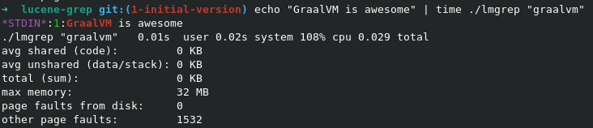

# lucene-grep
Grep-like utility based on [Lucene Monitor](https://lucene.apache.org/core/8_2_0/monitor/index.html) compiled with GraalVM native-image.

## Features

- Supports Lucene query syntax as described [here](https://lucene.apache.org/core/2_9_4/queryparsersyntax.html)
- Supports various text tokenizers
- Supports various stemmers for multiple languages
- Text output is colored or separated with customizable tags
- Supports printing file names as hyperlinks for click to open (check support for your terminal [here](https://gist.github.com/egmontkob/eb114294efbcd5adb1944c9f3cb5feda))
- Text output supports templates
- Scoring mode (disables highlighting for now)
- Output can be formatted as JSON of EDN
- Supports input from [STDIN](https://en.wikipedia.org/wiki/Standard_streams#Standard_input_(stdin))
- Supports filtering files with [GLOB](https://en.wikipedia.org/wiki/Glob_(programming)) [file pattern](https://docs.oracle.com/javase/8/docs/api/java/nio/file/FileSystem.html#getPathMatcher-java.lang.String-)
- Support excluding files from processing with GLOB
- Compiled with [GraalVM native-image](https://www.graalvm.org/reference-manual/native-image/) tool
- Supports Linux, MacOS, and Windows
- Fast startup which makes it usable as CLI utility

Startup and memory as measured with `time` utility on my Linux laptop:


The default output has a format: `[FILE_PATH]:[LINE_NUMBER]:[LINE_WITH_A_COLORED_HIGHLIGHT]`

NOTE: Not compatible with `grep`. When compared with `grep` the functionality is limited in most aspects.

## Quickstart

Grab a binary from [Github releases](https://github.com/dainiusjocas/lucene-grep/releases), extract, and place it anywhere on the path.

In case you're running MacOS then give run permissions for the executable binary:
```shell
sudo xattr -r -d com.apple.quarantine lmgrep
```

Then run it:
```shell
echo "Lucene is awesome" | ./lmgrep "Lucene"
```

## Examples 

Example of the `lmgrep`:
```shell
./lmgrep "main" "*.{clj,edn}"
=>
./src/core.clj:44:(defn -main [& args]
./deps.edn:22:   :main-opts   ["-m" "cognitect.test-runner"]}
./deps.edn:24:  {:main-opts  ["-m" "clj-kondo.main --lint src test"]
./deps.edn:28:  {:main-opts  ["-m clj.native-image core"
```

The default output is somewhat similar to `grep`, example:
```shell
grep -n -R --include=\*.{edn,clj} "main" ./
=>
./deps.edn:22:   :main-opts   ["-m" "cognitect.test-runner"]}
./deps.edn:24:  {:main-opts  ["-m" "clj-kondo.main --lint src test"]
./deps.edn:26:   :jvm-opts   ["-Dclojure.main.report=stderr"]}
./deps.edn:28:  {:main-opts  ["-m clj.native-image core"
```

Supports input from STDIN:
```shell
cat README.md | ./lmgrep "monitor lucene"
```
TIP: write your Lucene query within double quotes.

Various options with GLOB file pattern example:
```shell
./lmgrep --case-sensitive\?=false --ascii-fold\?=true --stem\?=true --tokenizer=whitespace "lucene" "**/*.md"
```
TIP: write GLOB file patterns within double quotes.

We can exclude files also with a GLOB pattern.
```shell
./lmgrep "lucene" "**/*.md" --excludes="README.md"
```
TIP: a GLOB pattern is treated as recursive if it contains "**", otherwise the GLOB is matched only against the file name.

Provide multiple queries:
```shell
echo "Lucene is\n awesome" |  lmgrep --query=lucene --query=awesome
=>
*STDIN*:1:Lucene is
*STDIN*:2: awesome
```

Provide Lucene queries in a file:
```bash
echo "The quick brown fox jumps over the lazy dog" | ./lmgrep --queries-file=test/resources/queries.json --format=json
=>
{"line-number":1,"line":"The quick brown fox jumps over the lazy dog"}
```

The contents of the Lucene queries file is in JSON format, e.g.:
```json
[
  {
    "query": "fox"
  },
  {
    "query": "dog"
  }
]
```

NOTE: when the Lucene queries are specified as a positional argument or with `-q` or `--query` params or with the `--queries-file`, all the queries are concatenated into one list.

## Deviations from Lucene query syntax

- The field names are not supported because there are no field names in a line of text.

# Supported options
```shell
Lucene Monitor based grep-like utility.
Usage: lmgrep [OPTIONS] LUCENE_QUERY [FILES]
Supported options:
  -q, --query QUERY                              Lucene query string(s). If specified then all the positional arguments are interpreted as files.
      --queries-file QUERIES_FILE                A file path to the Lucene query strings with their config. If specified then all the positional arguments are interpreted as files.
      --tokenizer TOKENIZER                      Tokenizer to use, one of: [keyword letter standard unicode-whitespace whitespace]
      --case-sensitive? CASE_SENSITIVE    false  If text should be case sensitive
      --ascii-fold? ASCII_FOLDED          true   If text should be ascii folded
      --stem? STEMMED                     true   If text should be stemmed
      --stemmer STEMMER                          Which stemmer to use for token stemming, one of: [arabic armenian basque catalan danish dutch english estonian finnish french german german2 hungarian irish italian kp lithuanian lovins norwegian porter portuguese romanian russian spanish swedish turkish]
      --with-score                               If the matching score should be computed
      --format FORMAT                            How the output should be formatted, one of: [edn json string]
      --template TEMPLATE                        The template for the output string, e.g.: file={{file}} line-number={{line-number}} line={{line}}
      --pre-tags PRE_TAGS                        A string that the highlighted text is wrapped in, use in conjunction with --post-tags
      --post-tags POST_TAGS                      A string that the highlighted text is wrapped in, use in conjunction with --pre-tags
      --excludes EXCLUDES                        A GLOB that filters out files that were matched with a GLOB
      --skip-binary-files                        If a file that is detected to be binary should be skipped. Available for Linux and MacOS only.
      --with-empty-lines                         When provided on the input that doesn't match write an empty line to STDOUT.
      --[no-]split                               If a file (or STDIN) should be split by newline.
      --hyperlink                                If a file should be printed as hyperlinks.
      --with-details                             For JSON and EDN output adds raw highlights list.
      --word-delimiter-graph-filter WDGF  0      WordDelimiterGraphFilter configurationFlags as per https://lucene.apache.org/core/7_4_0/analyzers-common/org/apache/lucene/analysis/miscellaneous/WordDelimiterGraphFilter.html
  -h, --help
```

NOTE: question marks in `zsh` shell must be escaped, e.g. `--case-sensitive\?=true` or within double quotes e.g. `"--case-sensitive?=true"` 

# Supported tokenizers

Tokenizers are the Lucene tokenizers:
- keyword
- letter
- standard (default)
- unicode-whitespace
- whitespace

Example:
```shell
echo "one.two" | ./lmgrep --tokenizer=letter "one" 
*STDIN*:1:one.two
```

# Supported stemmers

Unless `--stem?=false` is provided these Lucene stemmers are available:
- arabic
- armenian
- basque
- catalan
- danish
- dutch
- english (default)
- estonian
- finnish
- french
- german2
- german
- hungarian
- irish
- italian
- kp
- lithuanian
- lovins
- norwegian
- porter
- portuguese
- romanian
- russian
- spanish
- swedish
- turkish

Example:
```shell
echo "labai gerai" | ./lmgrep --stemmer=lithuanian "labas"                
=>
*STDIN*:1:labai gerai
```

## Phrase Matching with Slop

To match a phrase you need to put it in double quotes:
```shell
echo "GraalVM is awesome" | ./lmgrep "\"graalvm is\""
=>
*STDIN*:1:GraalVM is awesome
```

By default, when phrase terms are not exactly one after another there is no match, e.g.:
```shell
echo "GraalVM is awesome" | ./lmgrep "\"graalvm awesome\""
=>
```

We can provide a slop parameter i.e. `~2` to allow some number of "substitutions" of terms in the document text, e.g.:
```shell
echo "GraalVM is awesome" | ./lmgrep "\"graalvm awesome\"~2"
=>
*STDIN*:1:GraalVM is awesome
```

As a side effect, when the slop is big enough terms can match out of order, e.g.:
```shell
echo "GraalVM is awesome" | ./lmgrep "\"awesome graalvm\"~3"
=>
*STDIN*:1:GraalVM is awesome
```
However, if order is important there is no way to enforce it Lucene query syntax.

## Development

Requirements: 
- Clojure CLI
- Maven
- GraalVM with the `native-image` tool installed and on `$PATH`
- GNU Make
- Docker (just for rebuilding the linux native image).

Build executable for your platform:
```shell
make build
```
It will create an executable binary file named `lmgrep` stored at the root directory of the repository.

Run the tests:
```shell
make test
```

Lint the core with clj-kondo:
```shell
make lint
```

## Print results with a custom format

```shell
./lmgrep --template="FILE={{file}} LINE_NR={{line-number}} LINE={{highlighted-line}}" "test" "**.md"
```

| Template Variable     | Notes                                                     |
|-----------------------|-----------------------------------------------------------|
| `{{file}}`            | File name                                                 |
| `{{line-number}}`     | Line number where the text matched the query              |
| `{{highlighted-line}}`| Line that matched the query with highlighters applied     |
| `{{line}}`            | Line that matched the query                               |
| `{{score}}`           | Score of the match (summed)                               |

When `{{highlighted-line}}` is used then `--pre-tags` and `--post-tags` options are available, e.g.:
```shell
echo "some text to to match" | lmgrep "text" --pre-tags="<em>" --post-tags="</em>" --template="{{highlighted-line}}"
=>
some <em>text</em> to to match
```

## Scoring

The main thing to understand is that scoring is for every line separately in the context of that one line as a whole corpus.

Another consideration is that scoring is summed up for every line of all the matches. E.g. query "one two" is rewritten by Lucene into two term queries.

Each individual score is BM25 which is default in Lucene.

## WordDelimiterGraphFilter

Using this filter might help to tokenize text is various ways, e.g.:

```shell
echo "test class" | ./lmgrep "TestClass" --word-delimiter-graph-filter=99
=>
*STDIN*:1:test class
```

```shell
echo "TestClass" | ./lmgrep "test class" --word-delimiter-graph-filter=99
=>
*STDIN*:1:TestClass
```

The number 99 is a sum of options as described [here](https://lucene.apache.org/core/7_4_0/analyzers-common/constant-values.html#org.apache.lucene.analysis.miscellaneous.WordDelimiterGraphFilter.CATENATE_ALL). 

## Future work

- [ ] Optimize matching by [processing lines in batches](https://github.com/dainiusjocas/lucene-grep/issues/3)
- [ ] Automate builds for [multiple platforms](https://github.com/dainiusjocas/lucene-grep/issues/9)

## License

Copyright &copy; 2021 [Dainius Jocas](https://www.jocas.lt).

Distributed under The Apache License, Version 2.0.
